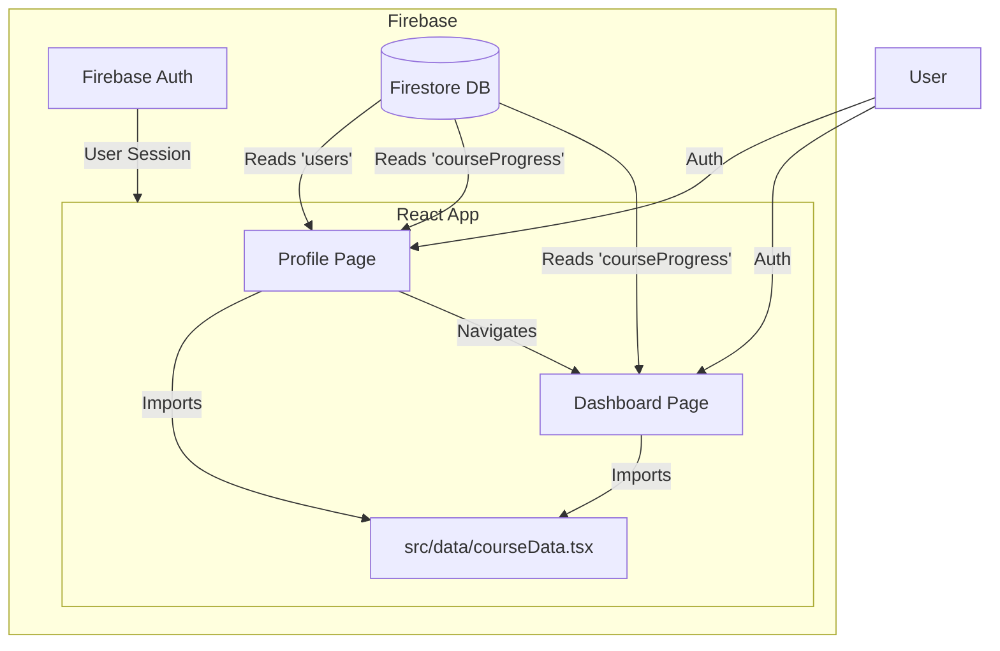

# Profile & Dashboard Architecture Documentation

## 1. Overview
The application features a dual-view system for user engagement:
*   **Profile Page (`Profile.tsx`)**: Acts as the user's home base, displaying personal details, membership status, and a "Learning Journey" overview of all available modules.
*   **Dashboard Page (`Dashboard.tsx`)**: A dedicated analytics view for tracking detailed course progress, statistics (learning hours, certificates), and filtering courses by status (Not Started, In Progress, Completed).

Both pages share a centralized data source and sync in real-time with Firebase Firestore.

---

## 2. Architecture & Data Flow



---

## 3. Data Models

### A. Static Course Data (`src/data/courseData.tsx`)
We maintain a centralized list of all **30 course modules** (Foundation, Specialized, Technical, Business, Practical) in the frontend code. This acts as the "source of truth" for course metadata (Title, Description, Icon, Default Status).

**Structure:**
```typescript
interface CourseModule {
  id: string;
  title: string;
  rating: string;
  participants: string;
  description: string;
  status: 'Not Started' | 'In Progress' | 'Completed' | ...;
  action: 'Start Course' | ...;
  icon: React.ReactNode;
}
```

### B. Dynamic Progress Data (Firestore: `courseProgress`)
User progress is stored in the `courseProgress` collection, keyed by the user's UID (`courseProgress/{uid}`).

**Document Structure:**
The document contains a map where **keys are course slugs** and **values are course objects**.

```json
{
  "general-knowledge": {
    "status": "in_progress", // Optional, calculated from modules if missing
    "startedAt": "timestamp",
    "modules": {
      "module-1": {
        "status": "completed",
        "completedAt": "timestamp",
        "quizScore": 100,
        "timeSpent": 45 // minutes
      },
      "module-2": {
        "status": "in_progress",
        "startedAt": "timestamp"
      }
    }
  },
  "ip-patent-strategy": {
    "status": "completed",
    "progress": 100
  }
}
```

---

## 4. Key Logic & Implementation

### 1. Data Merging Strategy
Both pages use a "Merge & Map" strategy to combine static metadata with dynamic progress:
1.  **Load Static List:** Start with `INITIAL_COURSE_DATA` (the 30 modules).
2.  **Fetch Firestore:** Get the user's `courseProgress` document.
3.  **Map & Match:** Iterate through the static list and find the corresponding Firestore entry using a **Slug**.

### 2. Slug Generation & Mapping
To match a UI title (e.g., "General Knowledge Foundations") to a database key (e.g., `general-knowledge`), we use a normalization process:

*   **Standard Slug:** `title.toLowerCase().replace(/[^a-z0-9]+/g, '-')`
*   **Fallback Mappings:** We explicitly handle known deviations to ensure data matches correctly:
    *   `general-knowledge-foundations` → `general-knowledge`
    *   `biotech-general-knowledge-mastery` → `biotech-general-knowledge`
    *   `ip-patent-strategy` → `ip-patent-strategy`

### 3. Progress Calculation Logic
The system automatically calculates the status of a course based on its modules:
*   **Completed:** 
    *   If `status` is explicitly "completed" in Firestore.
    *   OR If all modules in the course are marked "completed".
*   **In Progress:**
    *   If `status` is "in_progress".
    *   OR If any module has `startedAt` or is "completed" (but not all are done).
*   **Stats:**
    *   **Certificates:** Count of completed courses.
    *   **Learning Hours:** Sum of `timeSpent` from all completed modules (converted to hours).

---

## 5. Troubleshooting Common Issues

### "404 Not Found: courseData.ts"
*   **Cause:** The file was renamed from `.ts` to `.tsx` to support React icons (JSX). The development server or browser might still cache the old `.ts` reference.
*   **Fix:** Restart the Vite development server (Ctrl+C, then `npm run dev`) and refresh the browser.

### "CourseModule not exported"
*   **Cause:** Older versions of `Profile.tsx` had the interface defined locally.
*   **Fix:** We centralized the interface in `src/data/courseData.tsx`. Ensure all files import from there.

### Missing Progress on Dashboard
*   **Cause:** Mismatch between the course Title in the UI and the Slug in Firebase.
*   **Fix:** Check the `courseProgress` collection in Firebase Console. If the slug is different (e.g., `gen-knowledge` vs `general-knowledge`), add a mapping rule in `Profile.tsx` and `Dashboard.tsx`.
